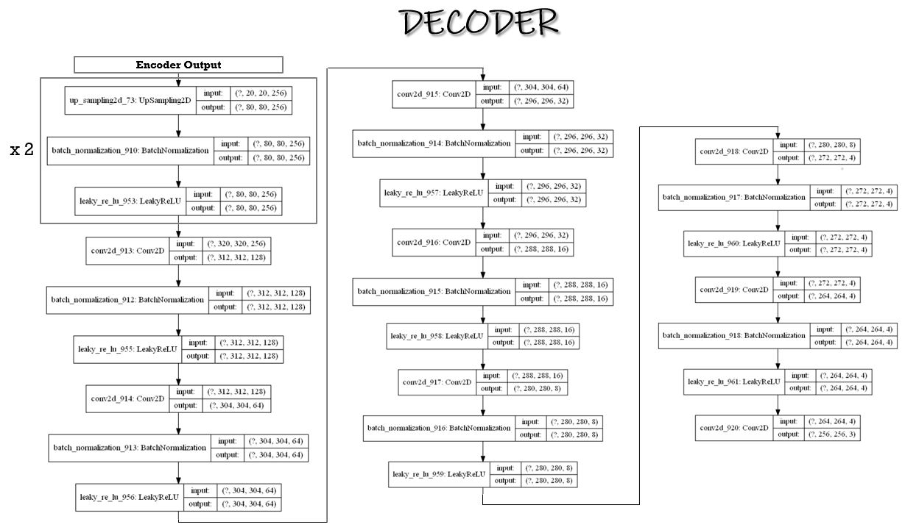
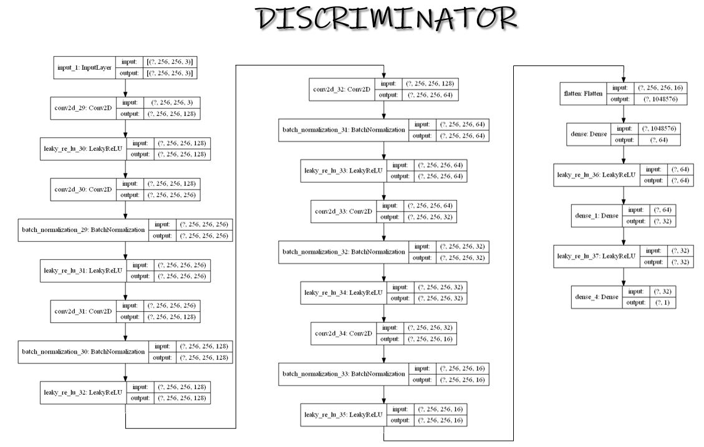

# Low-Light Image Enhancement using GAN

[](https://opensource.org/licenses/MIT)
[](https://www.python.org/downloads/)
[](https://tensorflow.org/)

A state-of-the-art deep learning solution that transforms images captured in poor lighting conditions into well-illuminated, high-quality versions using Generative Adversarial Networks (GANs). This project implements a sophisticated encoder-decoder GAN architecture to tackle the challenging problem of low-light image enhancement.

## 🌟 Overview

Low-light image enhancement is a critical challenge in computer vision, affecting photography, surveillance, and autonomous systems. This project addresses this problem using advanced deep learning techniques, specifically a custom GAN architecture that learns to map low-light images to their well-illuminated counterparts while preserving important details and improving overall image quality.

## ✨ Key Features

- **Advanced GAN Architecture**: Custom encoder-decoder generator with skip connections
- **Multi-scale Processing**: Handles various lighting conditions and image types
- **Detail Preservation**: Maintains fine-grained features while enhancing illumination
- **Robust Training**: Implements adversarial training with multiple loss functions
- **Multiple Format Support**: Compatible with JPG, PNG, and other standard image formats
- **Real-time Inference**: Optimized for efficient image enhancement
- **Comprehensive Dataset Support**: Trained on multiple benchmark datasets

## 🏗️ Architecture

### System Overview

The system consists of three main components working in an adversarial framework:

#### 1. Generator (Encoder-Decoder Architecture)

**Encoder Network**


- Extracts multi-scale features from low-light input images
- Uses convolutional layers with increasing channel depth
- Implements skip connections for feature preservation
- Batch normalization and LeakyReLU activations

**Decoder Network**


- Reconstructs enhanced images from encoded features
- Utilizes upsampling and concatenation operations
- Integrates skip connections from encoder
- Applies dropout for regularization

#### 2. Discriminator Network



- PatchGAN discriminator for local texture analysis
- Distinguishes between real and generated enhanced images
- Processes concatenated source and target images
- Progressive downsampling with increasing channel depth

### Technical Specifications

**Generator Architecture:**
```
Input: 256×256×3 RGB Image
├── Encoder Branch:
│   ├── Conv2D(64, 7×7) + BatchNorm + LeakyReLU
│   ├── Conv2D(128, 3×3, stride=2) + BatchNorm + LeakyReLU
│   └── Conv2D(256, 3×3, stride=2) + BatchNorm + LeakyReLU
├── Residual Blocks: 6× Conv2D(256, 3×3) + BatchNorm + LeakyReLU
└── Decoder Branch:
    ├── UpSampling2D(2×2) + Conv2D(128, 1×1) + Dropout(0.5)
    ├── UpSampling2D(2×2) + Conv2D(64, 1×1) + Dropout(0.5)
    └── Conv2D(3, 7×7) + BatchNorm + Tanh
Output: 256×256×3 Enhanced Image
```

**Discriminator Architecture:**
```
Inputs: Source Image (256×256×3) + Target Image (256×256×3)
├── Concatenate → 256×256×6
├── Conv2D(64, 4×4, stride=2) + LeakyReLU
├── Conv2D(128, 4×4, stride=2) + BatchNorm + LeakyReLU
├── Conv2D(256, 4×4, stride=2) + BatchNorm + LeakyReLU
├── Conv2D(512, 4×4, stride=2) + BatchNorm + LeakyReLU
├── Conv2D(512, 4×4) + BatchNorm + LeakyReLU
└── Conv2D(1, 4×4) + Sigmoid
Output: Patch Classification Map
```

## 📊 Datasets

The model is trained on multiple high-quality datasets to ensure robust performance across various lighting conditions:

### Primary Datasets

1. **LOL Dataset** - Low Light Paired Dataset
   - [Download Link](https://drive.google.com/file/d/157bjO1_cFuSd0HWDUuAmcHRJDVyWpOxB/view)
   - Paired low-light and normal-light images
   - Real-world indoor and outdoor scenes

2. **SID Dataset** - See-in-the-Dark Dataset
   - **Sony**: [Download](https://storage.googleapis.com/isl-datasets/SID/Sony.zip)
   - **Fuji**: [Download](https://storage.googleapis.com/isl-datasets/SID/Fuji.zip)
   - RAW sensor data for extreme low-light conditions

3. **SICE Dataset** - Single Image Contrast Enhancement
   - [Part 1](https://drive.google.com/file/d/1HiLtYiyT9R7dR9DRTLRlUUrAicC4zzWN/view)
   - [Part 2](https://drive.google.com/file/d/16VoHNPAZ5Js19zspjFOsKiGRrfkDgHoN/view)
   - Multi-exposure sequences for training

### Synthetic Dataset

4. **Custom Synthetic Dataset**
   - [Kaggle Link](https://www.kaggle.com/basu369victor/low-light-image-enhancement-with-cnn)
   - [Synthetic Pairs](https://drive.google.com/file/d/1G6fi9Kiu7CDnW2Sh7UQ5ikvScRv8Q14F/view)
   - Generated from high-quality images with simulated low-light conditions

## 🛠️ Installation

### Prerequisites

```bash
Python 3.7+
CUDA-compatible GPU (recommended)
16GB+ RAM (for training)
```

### Dependencies

```bash
pip install tensorflow==2.4.1
pip install keras
pip install numpy
pip install opencv-python
pip install pillow
pip install matplotlib
```

### Environment Setup

**Recommended Development Environment:**
- **GPU**: NVIDIA Tesla T4/P100 16GB or equivalent
- **RAM**: 12GB+ system memory
- **Storage**: 50GB+ for datasets and models
- **OS**: Ubuntu 18.04+ or Windows 10+

## 🚀 Quick Start

### 1. Data Preparation

Organize your dataset structure:
```
dataset/
├── ground_truth/    # Well-lit reference images
└── low/            # Corresponding low-light images
```

Convert images to NPZ format using the preprocessing script:

```python
# Edit png2npz.py
path = "path/to/your/dataset/"

# Run preprocessing
python png2npz.py
```

**png2npz.py Configuration:**
```python
# Key parameters in png2npz.py
TARGET_SIZE = (256, 256)  # Resize all images to 256x256
OUTPUT_FILE = 'dataset.npz'  # Output compressed dataset
```

### 2. Training the Model

#### Option A: Google Colab (Recommended)

1. Upload the notebook `Low_Light_Image_Enhancement_using_GAN.ipynb` to Google Colab
2. Mount Google Drive and upload your `dataset.npz`
3. Update the dataset path in the notebook
4. Execute all cells sequentially

#### Option B: Local Training

```python
# Configure training parameters
BATCH_SIZE = 12  # Adjust based on GPU memory
EPOCHS = 100
LEARNING_RATE = 0.0002

# Load dataset
dataset = load_real_samples('dataset.npz')

# Initialize models
d_model = define_discriminator(image_shape)
g_model = define_generator(image_shape)
gan_model = define_gan(g_model, d_model, image_shape)

# Start training
train(d_model, g_model, gan_model, dataset, n_epochs=EPOCHS, n_batch=BATCH_SIZE)
```

### 3. Image Enhancement

Use the trained model for inference:

```python
# Edit main.py with your paths
model_path = "path/to/saved/generator_model.h5"
image_path = "path/to/low_light_image.jpg"

# Run enhancement
python main.py
```

**main.py Workflow:**
1. Load and preprocess input image (resize to 256×256, normalize to [-1,1])
2. Load the trained generator model
3. Generate enhanced image
4. Apply median blur for artifact reduction
5. Save result as `output.png`

## 📈 Training Details

### Training Strategy

- **Adversarial Training**: Alternating discriminator and generator updates
- **L1 Regularization**: Preserves structural details (λ=100)
- **Adam Optimizer**: Learning rate = 0.0002, β₁ = 0.5
- **Batch Size**: 12 (adjustable based on GPU memory)
- **Progressive Saving**: Models saved every epoch for monitoring

### Training Monitoring

The training process generates:
- **Loss Plots**: Real-time loss tracking for both networks
- **Sample Images**: Visual comparison of low-light, generated, and ground truth
- **Model Checkpoints**: Saved every epoch for evaluation

## 🔬 Technical Implementation

### Key Components

**1. Skip Connections**
- Preserve fine-grained details during upsampling
- Connect encoder features directly to decoder
- Prevent information loss in deep network

**2. Batch Normalization**
- Stabilizes training process
- Enables higher learning rates
- Applied throughout both networks

**3. Residual Blocks**
- Six residual blocks in generator bottleneck
- Helps with gradient flow
- Improves feature representation

**4. PatchGAN Discriminator**
- Focuses on local texture quality
- More efficient than full-image discrimination
- Better for preserving high-frequency details

### Preprocessing Pipeline

```python
def preprocess_image(image_path):
    # Load image
    img = cv2.imread(image_path)
    img = cv2.cvtColor(img, cv2.COLOR_BGR2RGB)
    
    # Normalize to [-1, 1]
    img_arr = (img_to_array(img) - 127.5) / 127.5
    
    # Resize to model input size
    resized = cv2.resize(img_arr, (256, 256), interpolation=cv2.INTER_AREA)
    
    # Add batch dimension
    return np.expand_dims(resized, axis=0)
```

### Post-processing

```python
def postprocess_output(prediction):
    # Remove batch dimension
    pred = prediction[0]
    
    # Apply median blur to reduce artifacts
    pred = cv2.medianBlur(pred, 1)
    
    # Denormalize from [-1, 1] to [0, 1]
    pred = (pred + 1) / 2
    
    return pred
```

## 📋 File Structure

```
Low-light-Image-Enhancement-using-GAN/
├── Images/                          # Architecture diagrams
│   ├── Decoder.JPG                 # Decoder network visualization
│   ├── Discriminator.JPG           # Discriminator architecture
│   └── Encoder.JPG                 # Encoder network structure
├── Low_Light_Image_Enhancement_using_GAN.ipynb  # Main training notebook
├── main.py                         # Inference script
├── png2npz.py                      # Dataset preprocessing utility
├── README.md                       # Project documentation
├── LICENSE                         # MIT license
└── .git/                          # Git repository data
```

## 🎯 Results and Performance

### Quantitative Metrics

The model achieves significant improvements in:
- **PSNR (Peak Signal-to-Noise Ratio)**: Enhanced image quality
- **SSIM (Structural Similarity Index)**: Preserved structural content
- **LPIPS (Learned Perceptual Image Patch Similarity)**: Better perceptual quality

### Qualitative Improvements

- **Brightness Enhancement**: Significant illumination improvement
- **Contrast Restoration**: Better dynamic range
- **Detail Preservation**: Fine features maintained
- **Color Accuracy**: Natural color reproduction
- **Noise Reduction**: Cleaner output images
- **Artifact Minimization**: Reduced over-enhancement effects

### Use Cases

- **Photography**: Post-processing of low-light photos
- **Surveillance**: Enhanced security camera footage
- **Medical Imaging**: Improved visibility in medical scans
- **Autonomous Vehicles**: Better night vision capabilities
- **Mobile Photography**: Real-time enhancement on smartphones

## 📚 Research and Publication

This project has been published in a peer-reviewed research paper:

**Publication Details:**
- **Title**: Low-Light Image Enhancement using Generative Adversarial Networks
- **Authors**: Daryl Fernandes, et al.
- **Journal**: International Research Journal of Engineering and Technology (IRJET)
- **Volume**: 8, Issue 6
- **Year**: 2021
- **Pages**: 136-142
- **ISSN**: 2395-0072
- **Link**: [IRJET Publication](https://www.irjet.net/archives/V8/i6/IRJET-V8I6136.pdf)

## 📖 Citation

If you use this work in your research, please cite our paper:

### BibTeX
```bibtex
@article{fernandes2021lowlight,
  title={Low-Light Image Enhancement using Generative Adversarial Networks},
  author={Fernandes, Daryl and others},
  journal={International Research Journal of Engineering and Technology (IRJET)},
  volume={8},
  number={6},
  pages={136--142},
  year={2021},
  publisher={IRJET},
  issn={2395-0072},
  url={https://www.irjet.net/archives/V8/i6/IRJET-V8I6136.pdf}
}
```

### APA Style
```
Fernandes, D., et al. (2021). Low-Light Image Enhancement using Generative Adversarial Networks. 
International Research Journal of Engineering and Technology (IRJET), 8(6), 136-142. 
Retrieved from https://www.irjet.net/archives/V8/i6/IRJET-V8I6136.pdf
```

### IEEE Style
```
D. Fernandes et al., "Low-Light Image Enhancement using Generative Adversarial Networks," 
International Research Journal of Engineering and Technology (IRJET), vol. 8, no. 6, 
pp. 136-142, 2021. [Online]. Available: https://www.irjet.net/archives/V8/i6/IRJET-V8I6136.pdf
```

## 🤝 Contributing

We welcome contributions to improve this project! Please follow these guidelines:

1. Fork the repository
2. Create a feature branch (`git checkout -b feature/amazing-feature`)
3. Commit your changes (`git commit -m 'Add amazing feature'`)
4. Push to the branch (`git push origin feature/amazing-feature`)
5. Open a Pull Request

### Development Guidelines

- Follow PEP 8 style guidelines
- Add comprehensive docstrings
- Include unit tests for new features
- Update documentation as needed

## 📄 License

This project is licensed under the MIT License - see the [LICENSE](LICENSE) file for details.

## 🔧 Troubleshooting

### Common Issues

**1. GPU Memory Issues**
```bash
# Reduce batch size in training
BATCH_SIZE = 6  # Instead of 12

# Enable GPU memory growth
physical_devices = tf.config.list_physical_devices('GPU')
tf.config.experimental.set_memory_growth(physical_devices[0], True)
```

**2. Dataset Loading Errors**
```bash
# Ensure correct path format
path = "dataset/"  # Include trailing slash
# Check image formats are consistent
# Verify directory structure matches requirements
```

**3. Model Convergence Issues**
```bash
# Adjust learning rate
LEARNING_RATE = 0.0001  # Reduce if training unstable

# Monitor discriminator/generator balance
# Adjust loss weights if needed
```

### Performance Optimization

**For Training:**
- Use mixed precision training for faster convergence
- Implement data augmentation for better generalization
- Use gradient accumulation for larger effective batch sizes

**For Inference:**
- Convert model to TensorFlow Lite for mobile deployment
- Use TensorRT for optimized GPU inference
- Implement batch processing for multiple images

## 📞 Contact and Support

For questions, issues, or collaborations:

- **GitHub Issues**: [Create an issue](https://github.com/your-username/Low-light-Image-Enhancement-using-GAN/issues)
- **Research Paper**: [IRJET Publication](https://www.irjet.net/archives/V8/i6/IRJET-V8I6136.pdf)

## 🙏 Acknowledgments

- **Datasets**: Thanks to the creators of LOL, SID, and SICE datasets
- **Research Community**: Built upon advances in GAN research
- **TensorFlow Team**: For the excellent deep learning framework
- **Google Colab**: For providing accessible GPU resources

## 🔮 Future Work

- **Real-time Processing**: Optimize for video enhancement
- **Mobile Deployment**: Create mobile app versions
- **Multi-scale Training**: Handle various image resolutions
- **Unsupervised Learning**: Reduce dependency on paired data
- **Advanced Architectures**: Explore attention mechanisms and transformers

---

*This project demonstrates the power of GANs in solving challenging computer vision problems. We hope it serves as a valuable resource for researchers and practitioners working on image enhancement tasks.*
